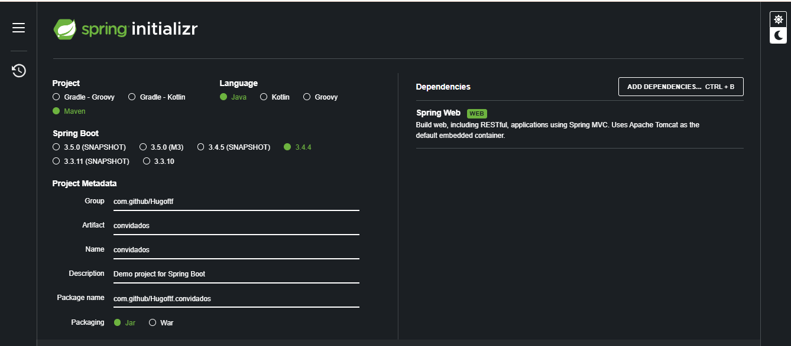
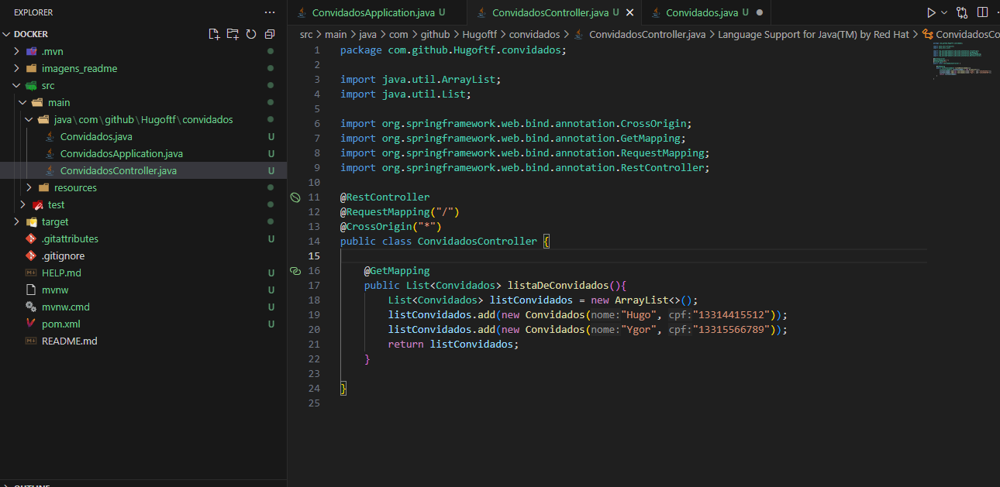

# Docker

  - [Tecnologias Usadas](#Tecnologias-Usadas)
  - [Sobre](#Sobre)
  - [Inicio](#Inicio)
  - [Utilizando o Beekeeper](#Utilizando-o-Beekeeper)
  - [Comandos Docker](#Comandos-Docker)
  - [Adicioando Java](#Adicioando-Java)
  

## Tecnologias Usadas

[Java](https://www.java.com/pt-BR/) / [Docker](https://www.docker.com/) / [MySQL](https://www.mysql.com/) / [VSCode](https://code.visualstudio.com/) / [Beekeeper](https://www.beekeeperstudio.io/)

## Sobre

Aprendendo a utilizar do zero o Docker e todas as suas funcionalidades, com um projeto em que engloba Java e Mysql

## Inicio

Docker é uma plataforma que permite empacotar, distribuir e rodar aplicações de forma leve e isolada usando containers. É como se você colocasse sua aplicação e tudo que ela precisa como dependências, sistema, configs, etc, dentro de uma caixinha portátil, que roda igual em qualquer lugar; no seu PC, no servidor, na nuvem. Em outras palavras ao invés de você baixar e instalar o MySQL no seu computador você instala ele via docker. Podemos atuar com ele via aplicação desktop e também por terminal(O mais comum a ser usado).

O primeiro passo é baixar e instalar o [Docker](https://www.docker.com/products/docker-desktop/) no computador. 

Nesse projeto irei utilizar o [VSCode](https://code.visualstudio.com/) tanto para desenvolvener em Java quanto para utilizar o terminal com o docker.

Agora iremos entender como o docker funciona, no terminal(qualquer terminal, eu vou usar o do VScode) digite o comando "docker images:

Essas são as imagens que estão no meu docker, são imagens antigas que foram criadas para outros projetos passados. Repository é o nome do programa, da imagem que você baixou, como posteSQL, MySQL, etc, a TAG se refere a versão daquela imagem, o imagem id é como se fosse o CPF da minha imagem, é unico, você pode referir com esse id com outros comandos docker, para remover por exemplo.

Existe um site chamado [Docker Hub](https://hub.docker.com/) é basicamente um repositório na nuvem para imagens, ele serve basicamente como um "GitHub para containers". No site você pode também criar e adicionar seu próprio container e para baixar outros:

O exemplo dessa imagem, da tecnologia MySQL para banco de dados, na esquerda ha a aba tags onde você pode pesquisar qual versão usar com links contendo a funcionalidade e atualização de cada versão, a direta está o comando para rodar no terminal para baixar, dessa forma:

Como não utilizamos nenhuma referencia a tag, ele irá baixar a ultima versão, para você baixar alguma versão em particular bastar utilizar o comando: docker pull msql:(aqui entra o numero da versão que você pesquisou na aba tag no docker hub).

Agora precisamos rodar o container do MySQL, apenas baixamos a imagem só com isso não podemos utilizar. No docker hub na aba da imagem do MySQL, mais abaixo, existe um tópico de como rodar uma imagem do MySQL:

Esse é o comando base, precisamos configurar ainda. Em "--name" aqui colocamos o nome do nosso container, o "-e" vai servir para configurar login e senha do Mysql, por padrão o login do mysql é root, o "-d" é para configurar a versão da tag do myql, como não colocamos versão iremos deixar apenas como está, também iremos adicionar o "-p" para configuar a porta do mysql e a porta do nosso pc:

Depois que rodou com sucesso utilizei o comando "docker ps" para exibir os container que estão rodando.

## Utilizando o Beekeeper

"O [Beekeeper Studio](https://www.beekeeperstudio.io/)  é um editor SQL e gerenciador de bancos de dados moderno, de código aberto e multiplataforma (disponível para Windows, macOS e Linux). Ele oferece uma interface gráfica intuitiva que facilita a conexão, consulta e gerenciamento de diversos sistemas de bancos de dados.​ " Você pode baixar e utilizar facilmente ele é um arquivo executavel.

Depois de baixar e executar, vamos nos conectar com nosso MySQL rodando no docker:

Primeira coisa que você vai fazer é ir na aba "new conections" selecionar o MySQL, e configurar. Basicamente em host e port, aqui você vai por o localhost que é o padrão para rede local do pc, e a port é a que configuramos executamos o container. Precisamos colocar o user e password, e também o Save connection (Que é o nome da nossa aplicação MySQL). Depois iremos testar nosso aplicação criando um Database e tabelas e colunas:

Seguindo esses passos, primeiro criando o database, segundo você precisa selecionar ele para que os outros comandos funcione, e então você cria tabela  e em seguida insere, por mim você da um select.

## Comandos Docker

Aqui vou mostrar os comandos básicos e útils do docker. Primeiro iremos recaptular os comandos que aprendemos, o primeiro foi o "docker images", ele serve para listar nossas imagens baixadas do docker hub. Depois aprendendos a criar uma imagem com "docker pull (nome da imagem : Versão da imagem). Depois aprendemos a rodar um container a partir da imagem baixada com o comando "docker run " onde existem algums parametros a se configurar dependendo da imagem, em seguida o comando "docker ps" para listar nossos container que estão rodando.

#### Docker Stop

Você pode parar o container com o comando docker stop (nome ou id):

Dessa forma se você tentar acessar o mysql pelo beekeeper, ele não vai conseguir conexão

#### Docker Start

Para rodar novamente um container já criado basta chamar o comando docker start(nome ou id):

repare que eu utilizei o comando docker ps -a, ele serve para listar todos os container criados e seus status, dessa forma se você não sabe o nome ou id do container que você quer startar você pode utilizar dessa forma

#### Docker delete

Para encerrar a parte de comandos básicos de docker o delete:

Eu baixei uma imagem e startei um contaier do mongoDB para ilustrar o delete, repare que o container está rodando ou up, e quando eu tento deletar um container que está up ele me retornar erro. Eu preciso primeiro stopar o container para depois deletar, repare que no comando stop eu digitei apenas alguns numeros do qual se refere ao container do mongoDB, e ele reconhece, você pode fazer dessa forma, desde que não tenha outro container com essas iniciais. Por fim o comando para deletar usado é o "docker rm (id ou nome).

## Adicionado Java

Nesse capitulo vamos adicionar java e Spring para servir de exemplo para nossas aplicações com o docker. O primeiro passo é ir até o site do [spring initialzr](https://start.spring.io/), ele vai criar uma base para nossa aplicação spring já com a dependencia Spring Web:

Proximo passo no nosso VSCode é criar a classe Convidados:

E a classe ConvidadosController:

Depois de rodar para testar o resultado é:

